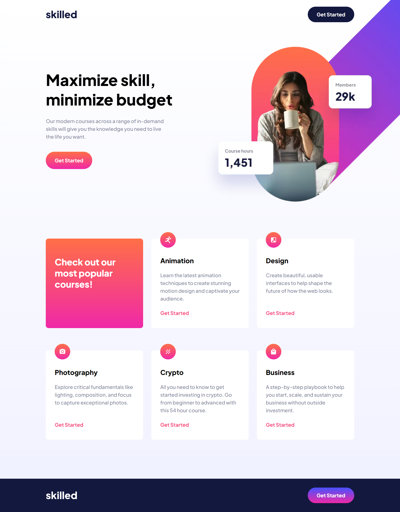
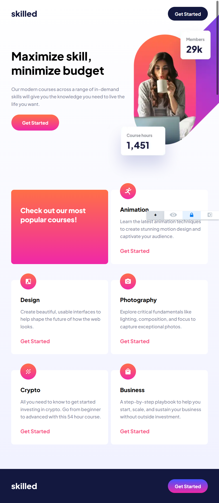
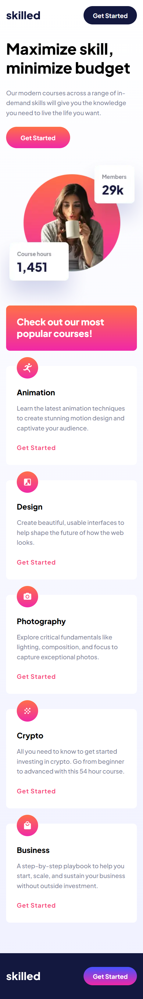

# Frontend Mentor - Skilled e-learning landing page solution

This is a solution to the [Skilled e-learning landing page challenge on Frontend Mentor](https://www.frontendmentor.io/challenges/skilled-elearning-landing-page-S1ObDrZ8q). Frontend Mentor challenges help you improve your coding skills by building realistic projects.

## Table of contents

- [Frontend Mentor - Skilled e-learning landing page solution](#frontend-mentor---skilled-e-learning-landing-page-solution)
  - [Table of contents](#table-of-contents)
  - [Overview](#overview)
    - [Screenshot](#screenshot)
    - [Links](#links)
  - [My process](#my-process)
    - [Built with](#built-with)
    - [What I learned](#what-i-learned)
    - [Continued development](#continued-development)
    - [Useful resources](#useful-resources)
  - [Author](#author)
  - [Acknowledgments](#acknowledgments)

## Overview

This is my solution to the Skilled E-Learning Landing Page. This is a one page
site that is fully responsive with three breakpoints with a mobile first
approach, tablet second and lastly for large screens such as desktops. For this
project I used the Vue framework with Typescript and SCSS for styling. I tried
to experiment with components and using layouts with vue slots and templates to
modulize the landing page for easy debugging.

### Screenshot





### Links

- Solution URL: [GitHub](https://github.com/newbpydev/10-skilled-e-learning-landing-page-vue-ts)
- Live Site URL: [Live Site](https://admirable-cupcake-53b019.netlify.app/)

## My process

### Built with

- Semantic HTML5 markup
- SCSS custom properties
- Flexbox
- CSS Grid
- Mobile-first workflow
- [Vue](https://vuejs.org/) - JS Framework
- [SASS](https://sass-lang.com/) - CSS Extension Language

### What I learned

I have learned on this project that I need to continue trying new things because
there is always more than one way to solve a certain problem, for example the
position of the image with a page overflow for full screen effect. On this
project I used the absolute positioning with an overflow-x of hidden so that the
screen would not scroll to the sides. I have also learned more about using
layouts using slots and templates in Vue.

```css
.course-card-alt {
  margin-top: 2.4rem;

  &__title {
    font-size: var(--fs-heading-s);
    font-weight: var(--fw-x-bold);
    color: var(--white-pure);
    border-radius: var(--border-radius-mobile-tablet);
    padding: 2.8rem 2.8rem 3rem;
    line-height: 3rem;
    background: linear-gradient(
      180deg,
      var(--grad-orange) 0%,
      var(--grad-pink) 100%
    );

    @media screen and (min-width: 48em) {
      padding: 5.6rem 3.2rem 13.9rem;
      line-height: 3.2rem;
      height: 100%;
    }

    @media screen and (min-width: 90em) {
      font-size: var(--fs-heading-m);
      line-height: 4rem;
      padding: 6.4rem 3.2rem 13.8rem;
    }
  }
}
```

```js
  <!-- @ if iconSrc -->
  <article class="course-card" v-if="iconSrc">
    <!-- # icon -->
    <div class="course-card__icon" v-if="iconSrc">
      
    </div>

    <!-- # heading -->
    <h3 class="course-card__heading">
      <slot name="heading" />
    </h3>

    <!-- # text -->
    <p class="course-card__text">
      <slot name="text" />
    </p>

    <!-- # button -->
    <div class="course-card__button">
      <ButtonComponent variant="ghost">
        <slot name="button-text" />
      </ButtonComponent>
    </div>
  </article>

  <!-- @ else -->
  <article class="course-card-alt" v-else>
    <h2 class="course-card-alt__title">
      <slot name="title" />
    </h2>
  </article>

```

### Continued development

For future development, I will continue to use flexbox to help me with the
layout of my components. I will also practice using SCSS to help manage my
styles. On this project I finally used the `picture` html tag with the
different image sources, I will continue to use this method to help manage the
assets in the different breakpoints.

### Useful resources

- [SASS - documentation](https://sass-lang.com/documentation/) - Sass is a stylesheet language that’s compiled to CSS. It allows you to use variables, nested rules, mixins, functions, and more, all with a fully CSS-compatible syntax. Sass helps keep large stylesheets well-organized and makes it easy to share design within and across projects.
- [VUE - Typing Component Props](https://vuejs.org/guide/typescript/composition-api.html#typing-component-props) - When using script setup, the defineProps() macro supports inferring the props types based on its argument:

## Author

- Website - [Juan Gomez](https://www.newbpydev.com)
- Frontend Mentor - [@newbpydev](https://www.frontendmentor.io/profile/newbpydev)
- Twitter - [@Newb_PyDev](https://twitter.com/Newb_PyDev)

## Acknowledgments

The code may not be perfect compared to my sensei @jonasschmedtman but I need
to thank him because he has shown me the ropes and now I am a confident web
designer.
