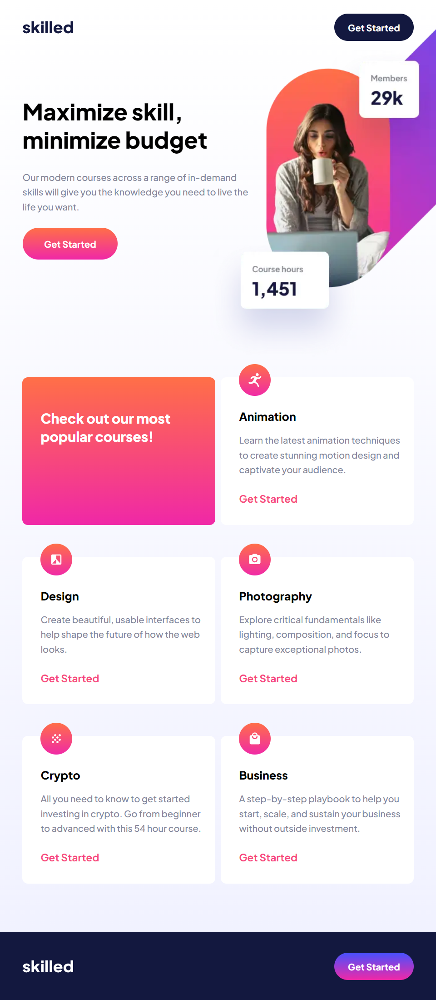

# Frontend Mentor - Skilled e-learning landing page solution

This is a solution to the [Skilled e-learning landing page challenge on Frontend Mentor](https://www.frontendmentor.io/challenges/skilled-elearning-landing-page-S1ObDrZ8q). Frontend Mentor challenges help you improve your coding skills by building realistic projects.

## Table of contents

- [Frontend Mentor - Skilled e-learning landing page solution](#frontend-mentor---skilled-e-learning-landing-page-solution)
  - [Table of contents](#table-of-contents)
  - [Overview](#overview)
    - [Screenshot](#screenshot)
    - [Links](#links)
  - [My process](#my-process)
    - [Built with](#built-with)
    - [What I learned](#what-i-learned)
    - [Continued development](#continued-development)
    - [Useful resources](#useful-resources)
  - [Author](#author)
  - [Acknowledgments](#acknowledgments)

## Overview

This is my solution to the Skilled E-Learning Landing Page. This is a one page
site that is fully responsive with three breakpoints with a mobile first
approach, tablet second and lastly for large screens such as desktops. For this
project I used the Vue framework with Typescript and SCSS for styling. I tried
to experiment with components and using layouts with vue slots and templates to
modulize the landing page for easy debugging.

### Screenshot





### Links

- Solution URL: [GitHub](https://github.com/newbpydev/10-skilled-e-learning-landing-page-vue-ts)
- Live Site URL: [Live Site](https://admirable-cupcake-53b019.netlify.app/)

## My process

### Built with

- Semantic HTML5 markup
- CSS custom properties
- Flexbox
- CSS Grid
- Mobile-first workflow
- [React](https://reactjs.org/) - JS library
- [Next.js](https://nextjs.org/) - React framework
- [Styled Components](https://styled-components.com/) - For styles

### What I learned

I have learned on this project that we need to practice everyday and work hard
to really understand how everything works, specially with the flexbox. Flexbox
is very powerful and useful but we much mind the margin spaces that might
influence the final spacing inside a flexbox. I must further study this topic.

```css
.interactive-rating {
  max-width: 32.7rem;
  height: 36rem;
  padding: 2.4rem 2.4rem 3.2rem 2.4rem;
  display: flex;
  flex-direction: column;
  justify-content: space-between;

  background: radial-gradient(
    98.96% 98.96% at 50% 0%,
    #232a34 0%,
    #181e27 100%
  );
  border-radius: var(--border-radius);
}
```

### Continued development

For future development, I will continue to use flexbox to help me with the
layout of my components. For the next project I would like to try new ways of
using flexbox. I have also used the input with a button type, I will futher
study this topic as well.

### Useful resources

- [MDN - input type="button"](https://developer.mozilla.org/en-US/docs/Web/HTML/Element/input/button) - input elements of type button are rendered as simple push buttons, which can be programmed to control custom functionality anywhere on a webpage as required when assigned an event handler function (typically for the click event).
- [MDN - Flexbox](https://developer.mozilla.org/en-US/docs/Learn/CSS/CSS_layout/Flexbox) - Flexbox is a one-dimensional layout method for arranging items in rows or columns. Items flex (expand) to fill additional space or shrink to fit into smaller spaces. This article explains all the fundamentals.

## Author

- Website - [Juan Gomez](https://www.newbpydev.com)
- Frontend Mentor - [@newbpydev](https://www.frontendmentor.io/profile/newbpydev)
- Twitter - [@Newb_PyDev](https://twitter.com/Newb_PyDev)

## Acknowledgments

The code may not be perfect compared to my sensei @jonasschmedtman but I need
to thank him because he has shown me the ropes and now I am a confident web
designer.
